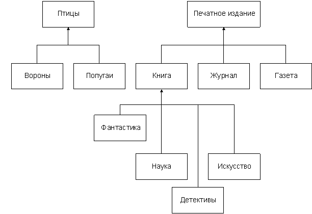
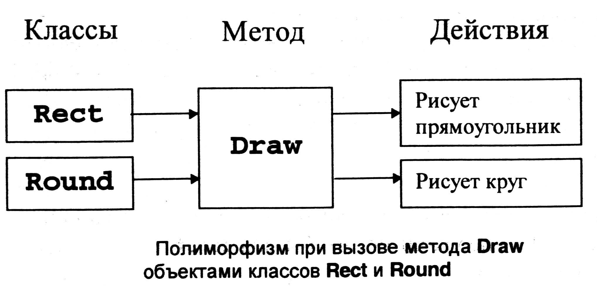

# OOP_C++
#### Термины
* **Полиморфизм** - способ языка программирования вызывать необ. имплемикацию.
* **Метод** - функция в класске.
* **Поле класса** - переменная в классе.
* **Парадигма** - стиль написания программы: _императивная_ и _декларативная_.
    **Имперактивная** задает последовательность команд (КАК надо что-то сделать).
    **Декларативная** (ЧТО надо сделать)
    **Иперативные парадигмы**: Процедурное программирование и ООП.
    **Декларативные парадигмы**: Функциональное программирование.
* **Паттерн программирования** - обобщенный метод решение какой-либо проблемы.
## Базовые принципы ООП:
1) **Наследование** - дочерний класс на основе родительского. Все методы род. класса доступны дочерниму.



```C++
class Box    // тип ``коробка``
{
  protected:
    int width,height;
  public:
    void SetWidth(int w)  { 
       width=w;  
    }
    void SetHeight(int h) { 
       height=h; 
    }
};
class ColoredBox : public Box  // ``цветная коробка``
{
   int color;
 public:
   void SetColor(int c)  { 
      color=c; 
   }
};
```

2) **Полиморфизм** - возможность исп. объекты с одинаковым интерфейсом одного класса, но на основе типа объекта.



```C++
// pointers to base class
#include <iostream>
using namespace std;

class Polygon {
  protected:
    int width, height;
  public:
    void set_values (int a, int b)
      { width=a; height=b; }
};

class Rectangle: public Polygon {
  public:
    int area()
      { return width*height; }
};

class Triangle: public Polygon {
  public:
    int area()
      { return width*height/2; }
};

int main () {
  Rectangle rect;
  Triangle trgl;
  Polygon * ppoly1 = &rect;
  Polygon * ppoly2 = &trgl;
  ppoly1->set_values (4,5);
  ppoly2->set_values (4,5);
  cout << rect.area() << '\n';
  cout << trgl.area() << '\n';
  return 0;
}
```

3) **Инкапсуляция** - сокрытие деталей имплемикации в классе. Доступ к необ. данным предоставляется через спец. _`public`_ метод. Защита данных от изменений.

```C++
#include <iostream>
using namespace std;

class Contact
{
    private:
        int mobile_number;           // private variable
        int home_number;             // private variable
    public:
        Contact()                    // constructor
        {
            mobile_number = 12345678;
            home_number = 87654321;
        }
        void print_numbers()
        {
            cout << "Mobile number: " << mobile_number;
            cout << ", home number: " << home_number << endl;
        }
};

int main()
{
    Contact Tony;
    Tony.print_numbers();
    // cout << Tony.mobile_number << endl;
    // will cause compile time error
    return 0;
}
```

**Класс** - это тип данных. Класс и структура отличаются тем, что у класса свое поле по умолчанию имеют модификатор _`private`_, а в структуре - _`public`_.

**Объекты** - экземпляры класса. 
_Класс_ - описание, на него не выделяется память.
_Объект_ - выделяется память.

**Модификаторы**: _`public, private, protected`_

```C++
class Point{
    //private
    private:
    ...
    public:
    ...
    protected:
    ...
}
```

**Виртуальная функция** - метод в родительском классе, котрый можно переопределить в дочернем классе.

```C++
#include <iostream>
using namespace std;
class X
{
protected:
  int i;
public:
  void seti(int c) { i = c; }
  virtual void print() { cout << endl << "class X : " << i; }
};
class Y : public X // наследование
{
public:
  void print() { cout << endl << "class Y : " << i; } // переопределение базовой функции
};
int main() 
{
  X x;
  X *px = &x;  // Указатель на базовый класс
  Y y;
  x.seti(10);
  y.seti(15);
  px->print();  // класс X: 10
  px = &y;
  px->print();  // класс Y: 15
  cin.get();
  return 0;
}
```

```C++
#include <iostream>
using namespace std;
class figure
{
protected:
  double x, y;
public:
  figure(double a = 0, double b = 0) { x = a; y = b; }
  virtual double area() { return(0); } // по умолчанию
};
class rectangle : public figure
{
public:
  rectangle(double a = 0, double b = 0) : figure(a, b) {};
  double area() { return(x*y); }
};
class circle : public figure
{
public:
  circle(double a = 0) : figure(a, 0) {};
  double area() { return(3.1415*x*x); }
};
int main()
{
  figure *f[2];
  rectangle rect(3, 4);
  circle cir(2);
  double total = 0;
  f[0] = &rect;
  f[1] = &cir;
  total = f[1]->area();
  cout << total << endl;
  total += f[0]->area();
  cout << total << endl;
  cin.get();
  return 0;
}
```

**Чисто виртуальная функция** - вирт.функция не имеющая имплемитации в родительском классе.
```C++
virtual double get_diagonal() = 0;
```
**friend function** - функция объявленная вне класса и его потомков, однако имеющая доступ к скрытым данным в нем.

```C++
// friend functions
#include <iostream>
using namespace std;

class Rectangle {
    int width, height;
  public:
    Rectangle() {}
    Rectangle (int x, int y) : width(x), height(y) {}
    int area() {return width * height;}
    friend Rectangle duplicate (const Rectangle&);
};

Rectangle duplicate (const Rectangle& param)
{
  Rectangle res;
  res.width = param.width*2;
  res.height = param.height*2;
  return res;
}

int main () {
  Rectangle foo;
  Rectangle bar (2,3);
  foo = duplicate (bar);
  cout << foo.area() << '\n';
  return 0;
}
```

**Статическое поле класса** - член класса, которое имееи общее состояние во всех созданных объектах.
&nbsp; _Изменить в одном объекте = изменить во всех объектах._

[**`static.cc`**](static.cc)

**Статический метод** - как и статическая переменная, также он нужен, чтобы получить доступ к скрытым статическим полям в классе.

```C++
#include <iostream>

void counter() {
  static int count = 0; // строка 4
  std::cout << count++;
}

int main() {
  for (int i = 0; i < 10; ++i) {
    counter();
  }
  return 0;
}
```
`Вывод программы:
0123456789`
```C++
#include <iostream>

void counter() {
  int count = 0; // строка 4
  std::cout << count++;
}

int main() {
  for (int i = 0; i < 10; ++i) {
    counter();
  }
  return 0;
}
```
`Вывод программы:
000000000`

**Статические функции** - члены класса целесообразно применять в случаях, когда в классе нужно использовать глобальные переменные, которые есть общими для разных объектов (экземпляров) этого класса.

```C++
#include <iostream>
 
class Person
{
public:
    Person(std::string p_name, unsigned p_age){
        ++count;    // при создании нового объекта увеличиваем счетчик
        name = p_name;
        age = p_age;
    }
    // статическая функция
    static void print_count(){
        std::cout << "Created " << count << " objects" << std::endl;
    }
private:
    std::string name;
    unsigned age;
    static inline unsigned count{};  // статическое поле - счетчик объектов Person
};
 
int main(){
    Person tom{"Tom", 38};
    Person bob{"Bob", 42};
    Person sam{"Sam", 25};
    tom.print_count();  // Created 3 objects
}
```

**Конструктор** - спец. метод класса, который инициализирует объекты.

Конструктор класса вызывается компилятором. Исп. для выделения памяти под объект класса;
Виды конструкторов:
* **По умолчанию** - не имеющий параметров.
* **Копирующий** - в качестве аргументы принимает другой объект.
* **Со списком инициализации** - инициализирует поле класса.
* **Преобразование** - изменяет поле класса.

Каждый класс может иметь только один конструктор по умолчанию. Это связано с тем, что в классе не может быть двух методов (функций) с одинаковой сигнатурой.

Конструктор не может возвращать значения (даже значение void). Если в конструкторе написать возвращение значения с помощью оператора `return`, то компилятор выдаст ошибку.

```C++
// copy constructor: deep copy
#include <iostream>
#include <string>
using namespace std;

class Example5 {
    string* ptr;
  public:
    Example5 (const string& str) : ptr(new string(str)) {}
    ~Example5 () {delete ptr;}
    // copy constructor:
    Example5 (const Example5& x) : ptr(new string(x.content())) {}
    // access content:
    const string& content() const {return *ptr;}
};

int main () {
  Example5 foo ("Example");
  Example5 bar = foo;

  cout << "bar's content: " << bar.content() << '\n';
  return 0;
}
```

**Параметризованный конструктор** – это конструктор класса, который имеет параметры.

**Деструктор** - спец. метод класса, который высвобождает память и уничтожает обьект.

**Виртуальный диструктор** - для уничтожение объекта, где содержиться хотя бы один вирутальный метод.

**Абстрактный класс** - класс, который имеет чистую виртуальную функцию. Он не может быть инициализирован. Он исп. для дальнейшего создания объектов конкретного типа, которые будут иметь функцианвльность родительского класса, но различную имплеминтацию вирутальных и читсто вирт. методов.
```C++
// deriv_AbstractClasses.cpp
// compile with: /LD
class Account {
public:
   Account( double d );   // Constructor.
   virtual double GetBalance();   // Obtain balance.
   virtual void PrintBalance() = 0;   // Pure virtual function.
private:
    double _balance;
};
```
Абстракция — это определение минимального набора полей и методов для решения определенной задачи.

Абстракцию не всегда выносят в отдельный принцип.

Абстракция позволяет игнорировать детали и сосредоточится на идеи решения задачи, на более высоком уровне.

Абстракция не является инкапсуляцией или сокрытием, они являются инструментами, которые помогают достигать абстракции.

**`Getter`** - метод класса, возращающий данные пользователю.

**`Setter`** - инициализирующий данные переданные аргументом.

Доступ к информациии членам и методам объекта описанным в открытой секции, осущ. через объект или ссылку на объект с помощью _операции выбора члена класса_ '**`.`**' (точку).

Если работа с оьъектами выполняется через указатель, то доступ осущ. с помощь _указателя на член класса_ '**`->`**' (стрелка).

Класс является **областью видимости** описанных в нем членов класса.

Операция **разширение области видимости** '**`::`**' позврляет получить доступ к одиночным обьектам. Также он исп. при описании метода класса.

Метод класса и любую функцию, не связанную не с каким классом, можно определить со спецификатором **`inline`**. Такие функции назыв. **встроенными**.
Основное преимущество использования встроенных (inline) функций – это ускорение времени выполнения программы. Это связано с тем, что при вызове inline-функции не расходуется время на: запись аргументов в стек,
чтение аргументов из стека при возвращении из функции.

Добавлять модификатор `inline` в объявление функции целесообразно в случаях, когда выполняются два основных условия:

* вызов функции происходит настолько часто, что отрицательно влияет на скорость выполнения программы или просто заметно замедляет выполнение программы. Например, функция может вызваться многократно в операторе цикла;
* объем кода функции есть небольшим. Функции, которые имеют большие объемы программного кода существенно увеличивают размер самой программы, что тоже, иногда, нежелательно. Поэтому в качестве встроенных, рекомендуется использовать только очень маленькие по размеру функции.

В большинстве случаев рекурсивные функции не могут быть использованы как inline-функции;

Нельзя сгенерировать `inline` функцию, которая содержит статические члены данных.

В некоторых случаях компилятор не может определить функцию как встроенную и просто игнорирует ключевое слово `inline`. Ниже перечислены возможные причины такого поведения компилятора:

1) Слишком большой размер функции.
2) Функция есть рекурсивной.
3) В одном и том же выражении функция может повторяться несколько раз.
4) В функции используются управляющие операторы `switch`, `if` или операторы цикла.

[**`inline.cc`**](inline.cc)

**Указатель `this`** - указатель на текущий объект. Его можно рассматривать как локальную константу, имеющию тип Х*.

#### Работа с динамической памятью

С++: `new` и `delete` <=> C: `malloc`, `calloc` и `free`.

`new` - выделяет память, операция _new_ возращает адресс начала выделенной динамической памяти соот. типа.

`delete` - освоюлждает выделенную операцией _new_ память.

```C++
// rememb-o-matic
#include <iostream>
#include <new>
using namespace std;

int main ()
{
  int i,n;
  int * p;
  cout << "How many numbers would you like to type? ";
  cin >> i;
  p= new (nothrow) int[i];
  if (p == nullptr)
    cout << "Error: memory could not be allocated";
  else
  {
    for (n=0; n<i; n++)
    {
      cout << "Enter number: ";
      cin >> p[n];
    }
    cout << "You have entered: ";
    for (n=0; n<i; n++)
      cout << p[n] << ", ";
    delete[] p;
  }
  return 0;
}
```

### Перегрузка

Существует два способа перегрузки любого оператора:

* с помощью операторной функции, которая реализована внутри класса;
* с помощью операторной функции, которая реализована как «дружественная (friend) к классу.
Статический полиморфизм реализуется на этапе компиляции с помощью перегрузки функции и операций.
Для перегрузки исп. ключевое слово `operator`.
**Бинарные операторы** – это операторы, которые для вычисления требуют двух операндов.

`тип operator символ_оператора(операнды) {тело_функции};`

Перегружать операции можно с помощью:
* функции-члена;
* функции-друга;
* глобальной функции;

Можно перегружать любые операции в С++, **КРОМЕ**:
* **`.`** - операция выбора члена класса;
* **`::`** - расширение области видимости;
* **`?.`** - условная операция;
* **`.*`** - разыменовывания укащателя на член класса;
* **`#`** - деректива препроцессора.
* **`sizeof`**
* **`typeid`**

Перегрузка _операции присваивания_ `=` может быть произведена только методом класса и не может быть перегружена функцией-друга.
В отличие от операции присваиваание операция `+=` (и др.  подобные).

Примеры:
```C++
#include <iostream>
#include <string>
#include <stdio.h>
#include <stdlib.h>
using namespace std;
```
```C++
class Dot
{
    friend class Line;
    friend istream& operator>>(istream&, Dot&);
    friend ostream& operator<<(ostream&, Dot&);
private:
    float x;
    float y;
public:
    Dot(float xx=0.0, float yy=0.0) : x(xx), y(yy) {};
    //Getters
    float getx() { return x; };
    float gety() { return y; }; 
};

//перегрузка оператора ввода
istream& operator>>(istream& input, Dot& p)
{
    char semicolon=';';
    input >> p.x >> semicolon >> p.y;
    return input;
}

//перегрузка оператора вывода
ostream& operator<<(ostream& output, Dot& p)
{
    char semicolon = ';';
    output << p.x << semicolon << p.y;
    return output;
}
...
```
`istream` - класс входных потоков.

`ostream` - класс выходных потоков.

```C++
class Point{
    static int n;
    int* coords;
    unsigned short size;
public:
    //конструктор по умаолчанию
    Point(){
        size = 2;
        coords = new int[size];
    }
    Point(unsigned short size){
        this->size = size;
        coords = new int[size];
    }
    Point(int* coords, unsigned short size){
        this->size = size;
        this->coords = new int[size];
        for(unsigned short i=0; i < size; ++i)
            this->coords[i] = coords[i];
    }

    ~Point() {delete [] coords;}
    
    friend ostream& operator<<(ostream &, const Point&);
    
    const Point& operator=(const Point& other){
        delete [] coords; 
        this->size = other.size;
        this->coords= new int[this->size];
        for(unsigned short i=0; i<this->size; ++i)
            this->coords[i] = other.coords[i];
        return *this;
    }
    
    const Point operator+(const Point& other){
        unsigned short copy_size = (other.size < this->size) ? other.size : this->size;
        Point ret(copy_size);
        for(unsigned short i=0; i<this->size; ++i)
            ret.coords[i] = this->coords[i] + other.coords[i];
        return ret;
    }
    const Point operator*(const Point& other);
    
    void showConsole(){
        for(unsigned short i=0; i<this->size; ++i) cout << coords[i] << " ";
        cout << "\n";
    }
};


const Point Point::operator*(const Point &other){
    unsigned short copy_size = (other.size < this->size) ? other.size : this->size;
    Point tmp(copy_size);
    for(unsigned short i=0; i<this->size; ++i)
        tmp.coords[i] = this->coords[i] * other.coords[i];
    return tmp;
}

int main () {
    int coords1[] = {1, 2}, coords2[] = {1, 2, 3};
    Point p1(coords1, 2);
    Point p2(coords2, 3);
    // p1 = p2
    Point p3;
    //p3 = p1 = p2
    Point c = p1 + p2;
    c.showConsole();
    Point f = p1 * p2;
    f.showConsole();
    
  return 0;
}
```
Пример перегрузки унарных и бинарных операторов для класса, который содержит одиночные данные. Операторная функция реализована внутри класса: [operator=](operator%3D.cc)

Пример перегрузки бинарного оператора ‘–’ в классе для которого реализована «дружественная» операторная функция: [operator-](operator-.cc)


**Унарные операторы** – это операторы, которые для вычислений требуют одного операнда, который может размещаться справа или слева от самого оператора.

При перегрузки унарной операции в том случае, если для нее определены две формы - **префиксная** и **постфиксная**, имеются особености.

**Префиксная (`++x`)** и **Постфиксная (`x++`)** дают один и тот же результат.

**Префиксная** увел. значение и затем возращает его.

**Постфиксная** сначала запоминает копию значения, увел. его и возращает сохраненную копию.

Для классов _префиксная_ немного более эффективна, чем _постфиксная_.
```
++x; // префиксная форма оператора инкремента
x++; // постфиксная форма оператора инкремента
--x; // префиксная форма оператора декремента
x--; // постфиксная форма оператора декремента
```
Пример перегрузки операторных функций ++ и –– в классе для одиночных объектов: [**`operator++--`**](operator%2B%2B--.cc)

Пример перегрузки операторных функций ++ и –– в классах, которые обрабатывают массивы: [**`opeator--++`**](operator--%2B%2B.cc)

Примеры операторных функций, которые перегружают операторы инкремента и декремента, и которые реализованы как «дружественные функции»: [**`opeator_friend++--`**](operatorfriend%2B%2B--.cc)

Пример, который демонстрирует перегрузку оператора += для класса Integer, который реализует целое число. Операторная функция объявляется внутри класса: [**`operator+=`**](opearator%2B%3D.cc)

Пример, который демонстрирует перегрузку оператора %= для класса Integer, который реализует целое число. Операторная функция объявляется как «дружественная» к классу Integer: [**`operator%=`**](operator%25%3D.cc)

Пример, который демонстрирует перегрузку оператора *= для класса Complex, реализущего комплексное число. Операторная функция реализована внутри класса: [**`operator*=`**](operator*%3D.cc)

В классе Complex реализуется операторная функция, которая перегружает оператор *=. Эта функция реализует умножение комплексных чисел по формуле:
`(a+bj)*(c+dj) = (a*c-b*d) + (a*d+b*c)j`

В каких случаях нужно перегружать операторы `new` и `delete`?
Оператор `new` нужно перегружать в случаях, если память выделяется по особому (нестандартным способом). Соответственно, оператор `delete` должен освобождать эту память нестандартным способом. Как правило, если в классе перегружается оператор new, то в этом классе также перегружается оператор `delete`.

Пример перегрузки операторов new и delete внутри класса для одиночных объектов:[**`opearator_delate_new`**](operator_delete_new.cc)

Пример перегрузки оператора присваивания для класса, который содержит одиночные переменные: [**`operator=`**](operator%3Done.cc)

На перегрузку оператора [ ] накладываются следующие ограничения:

* к этому оператору запрещено применять «дружественные» функции;
* операторная функция, перегружающая этот оператор, может быть нестатической функцией-членом.

Примеры перегрузки оператора индексирования элементов массива [ ]: [**`operator[]`**](operator%5B%5D.cc)

Примеры перегрузки оператора () вызова функции.

Задан класс SqEqual, содержащий все данные и методы для решения квадратного уравнения: [**`1_operator()`**](operator().cc)

Пример 2. Пусть задан класс Point, реализующий точку на координатной плоскости: [**`2_operator()`**](operator()2.cc)

Пример использования операторной функции operator()() которая используется в сочетании с другой операторной функцией operator+(): [**`operator+()`**](operator%2B().cc)

Пример перегрузки оператора -> в классе, который содержит одиночную внутреннюю переменную типа double: [**`operator->`**](operator-%3E.cc)
Пример перегрузки оператора ‘ , ‘: [**`operator,`**](operator%2C.cc)
##### Виды отношений между классами 
- **ассоциация** это отношение в котором объекты ссылаются друг на друга, но остаются независимыми. То есть в одном объекте есть ссылка на другой, которую можно передать через метод или напрямую.
```C++
class Sword {} 
class Slayer {
    private Sword sword;
    
    public void ChangeSword (Sword sword) {
        this.sword = sword;
    }
}
```
- **наследование** - один класс повторяет структуру другого класса.
```C++
class Parent {
    public void SayHi() {
        Console.WriteLine("Parent:: Hi!");
    }
}

class Child : Parent { }

class Programs {
    static void Main(string[] args) {
        Child child = new Child();
        // Дочерний класс использует метод родительского
        child.SayHi(); 
        
        // Вывод на консоль: 
        // Parent:: Hi!
    }
}
```
```C++
class Weapon {
    private double damage;
    public Weapon (double damage) {
        this.damage = damage;
    } 
    public double GetDamage() {
        return damage;
    }
}

class ColdSteel : Weapon {}
class Sword : ColdSteel {}
class Knife : ColdSteel {}

class Guns : Weapon {}
class Pistol : Guns {}
class Rifle : Guns {}
```
- **агрегация** - отношение между классами типа целая/часть.
```C++
class Sword {}
class Slayer {
    private Sword sword;
    public Slayer (Sword sword) {
        this.sword = sword;
    }
}
```
```C++
class Sword {
	private double damage;
    
	public Sword (double damage) {
		this.damage = damage;
	}
    
	public double GetDamage () {
		return damage;
	}
    
	protected void SetDamage (double damage) {
		this.damage = damage;
	}
}

class Slayer {
	private Sword sword;
    
	public Slayer (Sword sword) {
		this.sword = sword;
	}
    
	public double GetDamage () {
		Console.WriteLine ("Slayer damage: " + sword.GetDamage ());
		return sword.GetDamage ();
	}
}

class Program {
	static void Main (string[] args) {
		Sword sword = new Sword (100);
		Slayer slayer = new Slayer (sword);
		slayer.GetDamage ();
        
        // Вывод на консоль:
        // Slayer damage: 100
	}
}
```
- **композиция** объектов заключается в исп. объектов типов разработанных классов в качестве инф. членов при описании других классов.
```C++
class Heart {}
class Player {
    private Heart heart;
    public Player () {
        heart = new Heart ();
    }
}
```
```C++
class Heart {
	private double hitPoints;
	public event EventHandler OnDie;
    
	public Heart (double hitPoints) {
		this.hitPoints = hitPoints;
	}
    
	public void Heal (double points) {
		hitPoints += points;
	}
    
	public void Hurt (double points) {
		hitPoints -= points;
		if (hitPoints <= 0) {
			hitPoints = 0;
			Console.WriteLine("Heart Died!");
			OnDie?.Invoke (this, EventArgs.Empty);
		}
	}
}

class Player {
	private Heart heart;
    
	public Player (double hitPoints) {
		heart = new Heart (hitPoints);
		heart.OnDie += Die;
	}
    
	public void Heal (double healPoints) {
		heart.Heal (healPoints);
	}
    
	public void Hurt (double damage) {
		heart.Hurt (damage);
	}
    
	protected void Die (object sender, EventArgs e) {
		Console.WriteLine("Player Died!");
		// Do something...
	}
}

class Program {
	static void Main (string[] args) {
		Player player = new Player(100);
		player.Hurt(50);
		player.Hurt(25);
		player.Hurt(25);
        
        // Вывод на консоль:
		// Heart Died!
		// Player Died!
	}
}
```
- **реализация** - один класс исп. другой.
Реализация подразумевает наследование от интерфейса и реализация всех его методов.
Интерфейс — это контракт с классом, который обязует класс реализовать все методы интерфейса.
```C++
interface IWeapon {
    public double GetDamage ();
}

class Guns : IWeapon {
    private double damage;
    
    public Guns (double damage) {
        this.damage = damage;
    }
    
    // Реализация интерфейса
    public double GetDamage () {
        Console.WriteLine("Guns:: " + damage);
        return damage;
    }
}
```

#### Модификаторы наследования
& | public | protected | private 
---|---|---|---
| **public** | public | protected | private
| **protected** | protected | protected | private
| **private** | нет доступа | нет доступа | нет доступа
